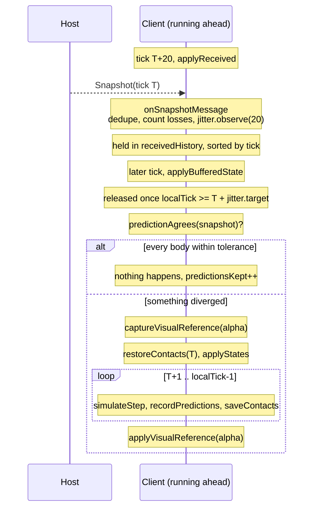

# Netcode

State synchronization for `engine/src/engine/net/`. Every peer simulates every body and shares one
tick timeline, with the host as the clock. Clients run a little ahead of the host so their input
arrives before the host needs it, send input rather than positions, and snap received state onto the
running simulation. The visible jump is hidden by `RigidbodyComponent`'s visual error offset.

Based on Glenn Fiedler's articles, which are the reference for most of what follows.

- [State synchronization](https://www.gafferongames.com/post/state_synchronization/)
- [Snapshot compression](https://www.gafferongames.com/post/snapshot_compression/)
- [Reading and writing packets](https://www.gafferongames.com/post/reading_and_writing_packets/)

## Files

| file | role |
|---|---|
| `NetArchive.h/.cpp` | Bit packing and quantization. Pure, no engine dependency. |
| `NetPeer.h/.cpp` | Connection layer over `ISteamNetworkingSockets`. |
| `INetworkEventHandler.h` | Where connection and message events land. |
| `ReplicationManager.h/.cpp` | Everything else. Host send path, client receive path, clock, rollback, debug UI. |
| `NetGraph.h/.cpp` | The per-tick overlay. |

`YELLOWTAIL_WITH_NETWORKING` gates the whole directory out of the engine's source globs, since it
needs SteamNetworkingSockets headers only a consumer supplies. See the root `CLAUDE.md`.

## The model in one paragraph

The host is authoritative and never rewinds. Clients run their clock ahead of the host, read local
input and file it for a tick a few steps in the future, and broadcast it. Everyone simulates every
body from the input they hold, extrapolating anyone whose newest frame has not arrived yet. When the
host's snapshot for tick T lands on a client that has already reached T+20, the client checks whether
it predicted those bodies correctly. If it did, nothing happens at all, which is the system working.
If it did not, the world is put back to T, and the twenty buffered ticks are replayed.

## The three delays

These are separate, are tuned separately, and get confused constantly. All three exist to make sure a
peer holds the input it needs at the moment it needs it.

| delay | who pays | what it buys |
|---|---|---|
| **Input delay** (`inputDelayTicks`) | The local player, whose own ball acts that many ticks late. | Everyone else simulates this ball exactly instead of guessing. |
| **Clock lead** (`measuredInputLead`) | Prediction quality of the host's own bodies. | Our input reaches the host before the host simulates that tick. |
| **Jitter hold** (`jitter.target`) | How far in the past a correction is. | Packets that clumped in transit are applied evenly. |

Input delay files a frame against a tick in the future rather than the tick being simulated, so it
has that many ticks of head start to reach everyone. Close that gap and their simulation of this ball
is exact rather than a guess repeated forward. The cost is that our own ball acts on the input that
late, which torque already hides on anything with mass.

Input delay and clock lead trade against each other, and `inputLeadTarget()` is where that trade is
made. What the host reports back is `clockLead + delay - transit`, so asking it for the whole delay
pins the clock lead to the transit however much delay is added. That is the wrong place for the
margin. The host is served equally well by either, but every tick of clock lead is a tick further
ahead of the host than we can ever predict it. So the client asks only for what the delay does not
already cover, and the clock settles at zero once the delay covers the trip.

The clock lead is seeded from the round trip on `Welcome` and then held by the feedback loop the host
reports. Neither half is redundant. RTT alone assumes both directions are equally fast and still
needs a guess at jitter, while the feedback loop measures what actually happened but needs somewhere
to start.

`steerInputDelay` targets `worstOneWay * 2 + InputLeadTarget`, fitted to measured crossovers of six
ticks at a 50ms round trip and twelve at 150ms. That is roughly a tick of delay per tick of round
trip plus the clock's dead band. It moves one tick at a time, because the clock steers against it and
a jump would drag the clock after it, leaving a seam in the history everyone predicting us reads.

The jitter hold rises at once and falls slowly. A packet later than the hold arrives after it was due
and pops whatever it moves, so there is no reason to ease into covering it. Giving slack back breaks
nothing, so there is no reason to hurry. It shrinks one tick per window of `jitterWindowPackets`, and
never below what the current window actually needed. The measurement is transit, meaning how many
ticks behind us a packet already was when it landed, so releasing every packet at the same transit
spaces them evenly however they arrived. An early one waits and a late one goes straight out.

## Wire format

### Bit packing

`BitWriter` and `BitReader` accumulate into a 64-bit scratch and spill a 32-bit word at a time, so a
field costs one shift-or rather than a write per bit. Storage is `uint32` for that reason, and the
buffer must be word aligned and a whole number of words. `onMessage` copies the payload into
`receiveWords` rather than reading in place, because the reader loads the trailing partial word in
full.

Both classes latch an `overflowed` flag. Every read after an overflow or a failed check marker
returns 0, so a truncated or hostile packet is discarded rather than acted on. Callers test
`hasOverflowed()` before trusting anything.

One templated `serialize*` function covers both directions for every structure, so a field added to
the write side cannot be forgotten on the read side. The one hand-maintained duplicate is
`entityBits`/`stateBits`, which mirror the writers to price a field before it is written. A
`SDL_assert` in `sendStateTo` compares the two, so drift surfaces there rather than as an oversized
packet much later.

### Quantization

State is quantized and deltas compare the integers rather than the source floats, since raw floats
jitter in their low bits and never compare equal.

| field | encoding | bits |
|---|---|---|
| Position | 3 axes, range encoded at 512 units/m over ±256m | 54 |
| Rotation | Smallest three, 2-bit index plus 3 × 10 bits | 32 |
| `atRest` | bool | 1 |
| Linear velocity | 3 axes, 16 units/m/s, ±128 m/s | 36 |
| Angular velocity | 3 axes, 16 units/rad/s, ±64 rad/s | 33 |

A moving body is 156 bits, a resting one 87. With three varint ids on top, roughly 22 bytes and 14
bytes respectively, so the 1000-byte payload budget holds about 44 moving entities.

Velocity travels with the pose because remote peers simulate this body rather than interpolate it,
and a body handed a position with no momentum coasts to a halt between updates. `atRest` carries both
velocities implicitly, which is what keeps a world full of settled objects off the wire entirely.

Rotation uses smallest-three because `q` and `-q` name the same rotation, so forcing the dropped
component positive lets it be rebuilt from the other three without storing its sign. Velocity bounds
sit well below `BodyProperties::maxLinearVelocity` on purpose. They cover what a body realistically
reaches rather than the theoretical cap, since every extra bit is paid on every update.

`quantizeState` clamps to the wire bounds itself rather than leaving it to `serializeInt`, so that
function's clamp warning stays a genuine programmer-error signal instead of firing per axis per
entity per packet.

### Design limit: the world is a box

The replicated world is a cube of ±`WorldExtentMeters` about the origin. A body outside it clamps to
the boundary and freezes there for every remote peer while its owner keeps simulating it. **Levels
must fit, and anything that can leave needs a kill volume.** The same failure one derivative up is a
body past `MaxLinearSpeed`, which every remote peer then simulates slower than it is really going and
keeps being corrected for.

Both cases log a throttled warning from `captureState`. Growing the world is a one-line change, since
every bit width follows from `bitsRequired`.

### Messages

First byte of every payload is a `NetMessageType`, so a receiver routes without guessing. **Never
renumber these.** Values from `GameFirst` (128) up belong to the game and the engine forwards them
uninterpreted.

| type | direction | delivery | contents |
|---|---|---|---|
| `Welcome` | host → joining client | reliable | Assigned peer id, host's current tick. |
| `Snapshot` | host → client | unreliable | Tick, complete flag, the entities that won the budget. |
| `ClientInput` | client → host, and client → peer | unreliable | Peer id, acked tick, a redundant window of input. |
| `PeerInput` | host → client | unreliable | Reported input lead, plus everyone else's input windows. |
| `PeerHello` | client → host | reliable | Where other clients can reach this one. |
| `PeerRoster` | host → clients | reliable | Every peer's address, resent whenever membership changes. |

Snapshots and input are unreliable throughout. A lost snapshot is replaced by the next one and
priority guarantees whatever it carried comes back around. A lost input packet is a non-event because
every packet repeats the last `NetInputRedundancy` frames, the same trick as deterministic lockstep.
Every peer stamps input with the shared tick, so a frame lands in the same slot on every machine and
a redundant copy repairs exactly the hole it was sent to repair.

## Topology

The host relays everyone's input by default. With `peerMesh` on, clients also dial each other
directly and broadcast their own input over those links as well. That hop matters because input
relayed through the host arrives a hop later than input sent straight across, and that hop is the
largest single part of what one client gets wrong about another.

Only one side of each pair dials, decided by `peerId <= localPeerId`. Both dialling on seeing each
other listed would double every link.

The mesh does not weaken authority. A client takes a peer's word for who it claims to be, since that
only feeds the local prediction of that peer's ball and the host's state still decides where the ball
actually went. A peer that lied would smear its own ball on our screen until the next snapshot and
nothing else. The host never does this. It keys input off the connection the packet arrived on, never
off the claimed id, so a client cannot drive another player's body by lying.

## Host send path

`capture` runs after the world's fixed tick and its deferred flush.

Input is forwarded **every tick**, separately from state. Clients simulate each other's balls from
these frames, so forwarding at the state rate left them acting on input a whole send interval stale,
which showed up as the other players constantly being corrected.

State goes out every `snapshotSendInterval` ticks. `captureHost` quantizes every replicated entity
once into `latestStates`, shared by every connection, and only the choice of what to send is per
client. `netId` indexes straight into it, so selection needs no lookups.

### Priority and the budget

Every entity accumulates priority for each client until it is sent, so a packet carries the most
valuable subset that fits and nothing starves. One passed over keeps climbing until it wins.

`basePriority` is deliberately small, since all it decides is what a starved connection gives up
first. Players first (×4), then the client's own body (×2), then a quarter weight for anything beyond
40m of whatever this client owns.

Anything whose state or owner changed owes a fresh round of `RestRedundancy` sends. Anything settled
counts down and goes silent, which is what makes a world of resting objects free. The redundancy
exists because a settled body would otherwise go quiet on the very packet announcing it settled, and
if that packet is lost it rests in the wrong place on that peer forever.

Each entity is charged what it actually costs, via `entityBits`. Pricing every entity at a single
worst case spent the packet on bits nothing was going to write, since a resting body is half the size
of a moving one and both fall well short of the largest ids the varints could hold.

The `complete` flag tells the client whether the packet is a restore point or only a correction.
Resting bodies left out do not count against it, since the host omitted them precisely because they
have not moved. An incomplete packet is safe to apply but not to replay from, because the bodies it
left out are still standing at the tick the client has reached, and stepping those forward again from
there would send them somewhere they were never going.

## Client receive path

`applyReceived` runs **before** the physics step, so a correction lands on the step that follows it.

### The jitter buffer

Snapshots are held rather than applied on arrival because packets clump, and a clump puts objects
from different packets out of phase in time, which pops anything stacked on something else.

They are applied in place rather than consumed, so a duplicate arriving later still finds its tick
and is recognised as a duplicate. `appliedTick` stops one being applied twice and stops a reordered
older packet dragging the world backwards.

Losses are counted from gaps in the tick numbers rather than from the backend, so the number measures
what the simulation actually went without. The host sends on a fixed interval, so a jump of more than
one interval is exactly the snapshots that went missing.

### Judging the prediction

The only honest measure is the host's answer for tick T against **what we predicted for that same
tick T**, which is why `PredictedPoses` exists. Comparing the host's answer to where the body stands
now measures the clock lead, and the lead is the system working, so that comparison reports a large
error on a body predicted perfectly.

Pose, not just position. A ball can sit within centimetres of where the host has it while its spin
has drifted, and on anything with a visible surface that is the more obvious error of the two.
Position and angle have independent tolerances because they diverge independently, as with a sphere
slipping on contact or airborne with no rolling contact to couple them.

A missing prediction counts as disagreement.

### Rollback and replay

Applying a snapshot on its own would leave the whole world standing as far in the past as the packet
reaches. Replaying is the only thing that keeps a remote player at the present rather than a round
trip behind, which is what makes colliding with one feel like colliding with a player.

Contacts are restored **before** the bodies move onto the snapshot, so the first replayed step solves
from the contacts that belonged to that tick rather than the ones the present left behind.

What that restore carries is solver history, not geometry. Jolt reruns broad phase and narrow phase
from the current body positions every step regardless, so the saved cache is not there to skip
collision detection. It holds the accumulated impulses each contact ended the previous step with
(`mNonPenetrationLambda`, `mFrictionLambda`), which `WarmStartVelocityConstraints` seeds the solver
with. A sequential-impulse solver run for a fixed iteration count does not fully converge, so the
starting guess changes the answer, and for a resting or stacked body that is the difference between
a stable contact and a visible resettle. The cache also lets `GetContactsFromCache` reuse a whole
manifold when a pair has barely moved, which decides whether narrow phase runs for that pair at all.
Neither is derivable from positions, which is why a replay cannot simply regenerate it.

The cache is keyed by `BodyID`, so it is only valid while the body set is unchanged. `createBody` and
`removeBody` throw away every saved slot, and `restoreContacts` refuses an empty one rather than
handing Jolt ids that no longer exist. `ReplicationManager` drops its whole contact window on a
refusal and rebuilds it from the next tick. Changing motion type does not invalidate anything, since
the `BodyID` survives.

The replay runs up to but not including `localTick`, since `applyReceived` runs before this tick is
stepped and the caller's own `simulateStep` finishes the catch-up.

Each replayed tick rewrites `recordPredictions` and `saveContacts` for itself. Left stale, the next
packet would compare against predictions this correction already invalidated, could never agree, and
one divergence would become a resimulation on every packet from then on.

The visual reference is captured before the rewind and applied after, so the rewind and the catch-up
are hidden together as one movement rather than a jump backwards followed by a scramble forwards. It
is taken on the snap-only path too, which moves bodies furthest and so needs the smoothing most.

Two cases skip the replay and leave the world in the past, both counted and warned about. The packet
is incomplete, or it is further back than `MaxRollbackTicks`.

### Late input

`InputHistory::read` records what it handed back, not just what it holds. That is what lets a frame
arriving later for an already-simulated tick be recognised as contradicting a guess rather than
quietly filed. `replayLateInput` then replays from `lastApplied`, the newest snapshot applied, rather
than from the offending tick. That costs a few extra steps and avoids needing a saved body state for
every tick.

Read semantics matter here. A tick with no frame carries the newest one forward rather than dropping
to neutral, so a rolling ball whose owner is still holding forward keeps being pushed while the next
packet is late. This is the normal case for anyone but ourselves, because we simulate ahead of what
we hold for them, so it is not counted as starvation. Only giving up entirely is.

**Every input bit must mean "I am holding this", never "pressed just now".** Carrying a held bit
forward is harmless and carrying an edge forward is not, so an edge-triggered bit would be lost every
time a peer's input ran late. `repeated` counts ticks where this happened, and is what a missing jump
looks like.

## Entity resolution

Both peers load the same scene and scene loading preserves entity ids, so the host's `EntityId` names
the client's copy too. A `netId` that resolves to nothing means the two scenes differ, whether from a
stale copy, an unsaved edit, or an entity the host spawned at runtime, and it warns rather than
failing silently.

Runtime-spawned entities are not supported yet. See the TODO on `EntitySnapshot::hostEntityId`, which
should move into spawn records along with the component data such an entity would need.

## Invariants

Several of these are asserted, and the rest are checked at runtime or not at all. Worth knowing
before changing a constant.

- `MaxRollbackTicks < PhysicsManager::MaxSavedContacts`. A replay needs a saved contact set for every
  tick it covers. Asserted.
- `MaxRollbackTicks < InputHistory::Length`. A replay is only as good as the input it can still look
  up. Asserted.
- `MaxInputLeadTicks + MaxJitterTicks < InputHistory::Length`. Both bound how stale the input driving
  a body can get. Asserted.
- `MaxStatePayloadBytes < SoftPacketBytes`, so a snapshot is one datagram.
- `nextNetId` only grows, and `ClientSyncState` vectors are indexed by it directly, so `grow` must be
  called before any indexing.
- Input windows are always fully consumed on read, even for a peer id we have no use for. Skipping
  the bits rather than reading them would misalign the rest of the packet.

## Diagnostics

The debug UI is around a third of `ReplicationManager.cpp` and exists because none of the above can
be judged by reading it. Numbers worth knowing how to read:

- **Correction mean/peak.** How far each snap moves a body. Near zero means the local simulation
  agreed with the host. Every prediction change is judged against this.
- **Prediction kept.** Packets that needed no replay. Climbing steadily is the whole system working,
  since the client guessed right and paid nothing.
- **Replayed steps per second.** Depth times rate, the extra physics being run. Against the 60 a tick
  normally costs, 60 here means the simulation is doing twice the work.
- **Input lead.** Should sit at the target. Drifting below means our input reaches the host late and
  it is guessing.
- **Jitter hold vs worst transit.** The hold is what the connection asked for, not what it was
  configured with. Worst transit far above it means the estimator has shrunk since a spike.
- **Input age.** Expected to sit near the clock lead plus the trip from the host, since we simulate
  ahead of the input we hold for anyone else. Growing without bound means that peer stopped sending.
- **Snapped without replay.** Each one left the world a rollback's worth of time in the past.

The **net graph** is one column per fixed tick rather than per frame, because everything it reports
is decided on the tick timeline and a frame spanning two ticks would smear two answers into one. The
worst body decides a column's correction, since an average over a mostly settled world would hide the
one body that was wrong.

**Ghosts** draw the last state the host sent. The error line runs to where we had that body at the
tick the ghost describes, not to where it stands now, because a ghost trails the body by the clock
lead plus the trip plus the jitter hold no matter what and none of that is error. The velocity arrow
shows where the host thinks it is heading, so a ghost sitting still while the local copy moves means
the host is not applying the input driving it here.

**Traces.** `openTrace` appends every replicated body's pose, as this peer sees it, once per tick.
Joining two peers' traces on `(tick, netId)` gives the prediction error directly, which is the only
way to ask "did A predict B correctly" without watching two windows and guessing. `tools/nettest.py`
consumes these.

## Tuning defaults

Live rather than `constexpr`, because they are judged by watching balls collide under lag and this
project is far too expensive to rebuild once per guess. Sliders are in `drawTuning`. They are process
globals, shared by every instance, which is intentional for a tuning knob.

Defaults are meant to hold together up to about 300ms rather than be tuned for it. What that latency
costs is staleness. A packet is roughly twenty ticks behind by the time it can be applied, so every
threshold treats that as normal rather than as a fault. In particular `MaxInputStaleTicks` is a "that
peer is gone" threshold and not a latency one, since at 300ms a remote player's newest input is
routinely 20 ticks behind the tick being simulated and cutting them off there would stall every
remote ball.

| constant | default | why |
|---|---|---|
| `snapshotSendInterval` | 6 | 10 per second at 60Hz. Halving it halves how long a mispredicted remote player runs before correction, at double the state bandwidth. |
| `minJitterTicks` | 2 | Floor only, for a connection whose first packets happen to arrive evenly. |
| `jitterMargin` | 2 | Real jitter at this latency moves further than a single tick. |
| `jitterWindowPackets` | 30 | Three seconds per shrink step. A connection that spikes will spike again. |
| `inputDelayTicks` | 4 | Two ticks absorbs the clock lead on a local connection, leaving two for the hop. |
| `maxInputDelayTicks` | 8 | Past this, prediction degrades rather than the controls getting heavier. |
| `predictionTolerance` | 0.05 | 5cm, well inside a ball and far looser than the 2mm the wire expresses. |
| `predictionAngleTolerance` | 0.14 | Eight degrees. A ball at the angular cap covers that in a couple of ticks. |

Past `MaxInputLeadTicks` the clock cannot get far enough ahead for our input to reach the host in
time and nothing else in the system can compensate, so `leadFromPing` warns and clamps. What degrades
first is only the host's ball, since that one costs a round trip (our input out, its input back)
while a body predicted over a direct peer link costs one hop and stays covered.

## Known gaps

- No runtime-spawned entity support. Everything replicated must exist in the scene both peers load.
- No tests. `BitWriter`/`BitReader` roundtrip, `quantizeState`/`dequantizeState`,
  `InputHistory::read` carry-forward, and `JitterEstimator::observe` are pure and would be the
  highest-value place to start.
- `ReplicationManager` holds the host path, the client path, the clock, and the debug UI in one
  class. The debug UI is the cheapest thing to split out.
- `findReceived` is a linear scan of `receivedHistory` on every arriving snapshot. Fine at 32 entries.
