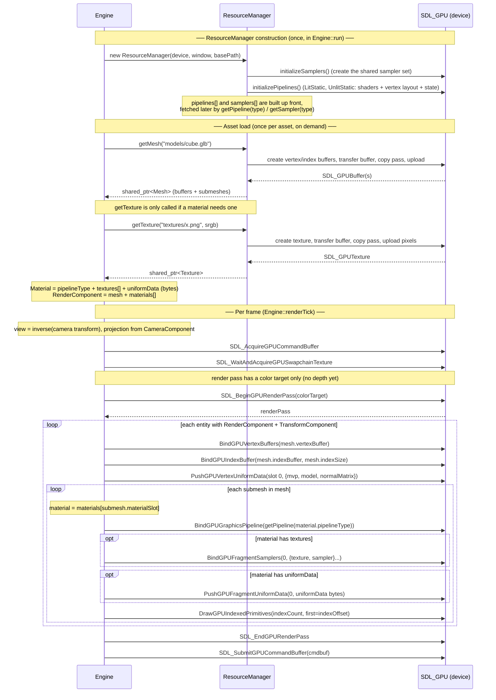

# Render pipeline

How a mesh/material is rendered in yellowtail, split into **load-time** setup
(via `ResourceManager`) and the **per-frame** draw (`Engine::renderTick`).

## Notes

- **Three phases.** Samplers + pipelines are created once when the `ResourceManager`
  is constructed (`initializeSamplers` / `initializePipelines`). Meshes and textures
  are loaded on demand and cached. The per-frame loop does **no** allocation or
  uploading — it only *binds* and *draws*.

- **Pipelines are pre-built and fetched by type.** `initializePipelines` builds one
  pipeline per `PipelineType` (currently `LitStatic` and `UnlitStatic`) and stores them
  in an array. A `Material` holds a `pipelineType`, and `renderTick` resolves it with
  `getPipeline(material.pipelineType)` each submesh. (Meshes/textures use string-keyed
  caches; pipelines/samplers use fixed enum-indexed arrays.)

- **Bind granularity, outer → inner.** Only the **mesh buffers** (vertex/index) and the
  **vertex transform uniform** bind once per entity — they're shared across all of a
  mesh's submeshes. Everything else is **per-submesh**, because each submesh's material
  can resolve to a *different pipeline* (e.g. one submesh lit, another unlit). So the
  pipeline bind lives *inside* the submesh loop. A single-material mesh runs that inner
  loop once.

- **Fragment binds are conditional.** Textures are bound only if the material has any,
  and the fragment uniform is pushed only if `uniformData` is non-empty. The current
  unlit cube has **neither** — `Unlit.frag` takes no samplers and no uniform buffers,
  so those steps are skipped.

- **Uniforms flow per-draw, not baked.** `PushGPUVertexUniformData` (`mvp`/`model`/
  `normalMatrix` from the `TransformComponent` × camera) and any
  `PushGPUFragmentUniformData` go onto the **command buffer** right before the draw —
  the shared pipeline reads whatever's current. That's why many objects with different
  transforms all reuse one pipeline.

- **One render pass, one submit per frame.** The command buffer and render pass wrap the
  *whole* frame; every entity records into the same `renderPass`.

## Known gaps / TODO

- **No depth buffer yet.** The render pass has a color target only. The single convex
  cube looks correct because the pipeline uses **back-face culling**
  (`cull_mode = BACK`, `front_face = COUNTER_CLOCKWISE` to match glTF winding). Multiple
  or concave objects will need a depth attachment + `depth_stencil_state`.

- **Rendering lives in `Engine::renderTick`.** It may later move into a dedicated
  `RenderSystem`, and redundant pipeline binds could be reduced with a sort/batch pass
  (group draws by pipeline). Neither is needed to get pixels on screen.
